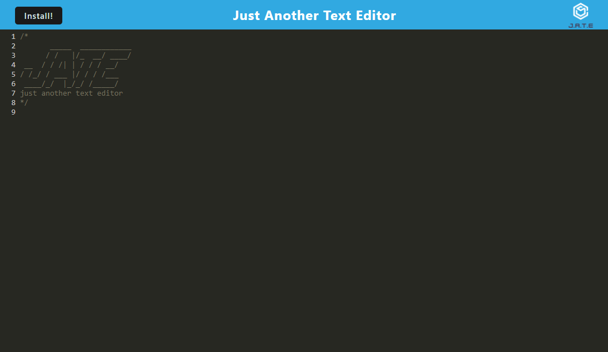
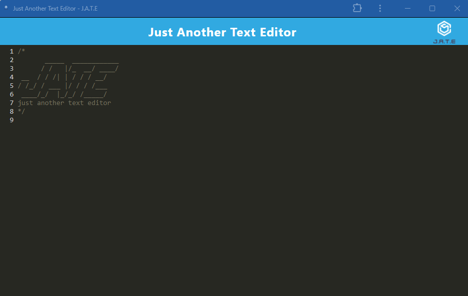

# PWA Text Editor

## Description

Just another text editor that runs in the browser or can be downloaded to work offline.

View the deployed application here: https://pwa-text-editor-w9hd.onrender.com/

## Installation

To install the application for offline use, users should click the "Install" button.

## Usage

The following screenshot shows the application being run in the browser:

The following screenshot shows the application being run offline, after downloading:

To use the application, users should simply type. Their notes will be saved in the IDBDatabase.

## Credits

The front-end of this application was built by edX Boot Camps LLC

## License

[MIT License](./LICENSE)